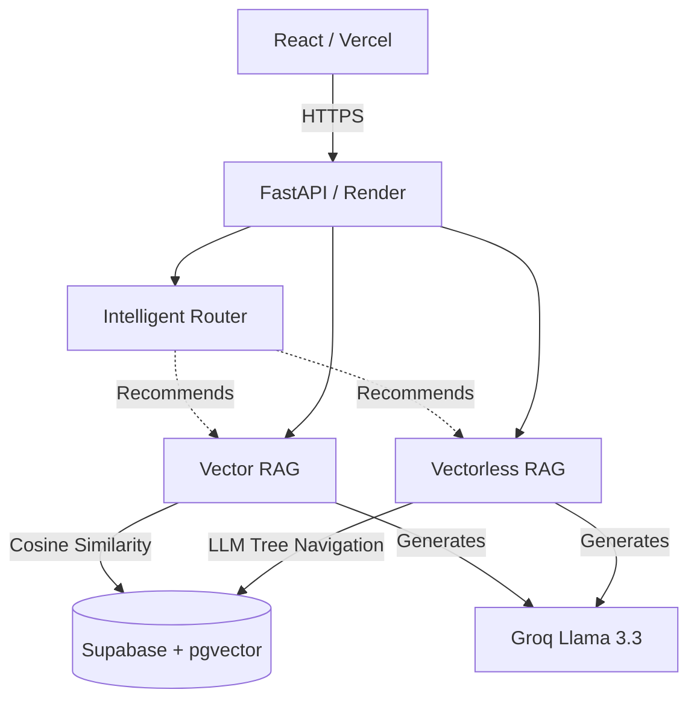

# RAG-Arena ⚔️

A side-by-side benchmarking system and chatbot-arena for two Retrieval-Augmented Generation (RAG) paradigms: classical **Vector RAG** (embeddings + similarity search) and from-scratch **Vectorless RAG** (hierarchical tree navigation). It includes an intelligent AI router that recommends the better approach based on the document's structure and the query's intent, and crowdsources user feedback to evaluate human preferences.

> **Live Demo**: [https://rag-arena-three.vercel.app](https://rag-arena-three.vercel.app)  
> *Note: Hosted on Render's free tier. UptimeRobot is configured to keep it warm, but if a spin-down occurs, please allow 30 seconds for cold starts.*

---

## 📖 The Core Concept

Most modern RAG systems embed documents into vectors and retrieve the most mathematically similar chunks for any given query. This works well for fuzzy, semantic questions over unstructured text. 

However, for structured documents like **10-Ks, legal contracts, and technical manuals**, vector similarity often fails. A keyword like "revenue" might appear on 50 different pages, pulling in irrelevant chunks and confusing the LLM. 

**Vectorless RAG** skips embeddings entirely. Instead:
1. **At Ingest Time:** It parses the document into a hierarchical table of contents (a tree).
2. **At Query Time:** An LLM navigates this tree branch-by-branch (like a human reading an index) to locate the precise section containing the answer.
3. The LLM then reads that entire section to synthesise the final answer.

**RAG-Arena runs both pipelines in parallel on every query,** displaying the answers, latencies, token costs, and exact text chunks retrieved side-by-side so you can evaluate which approach wins.

---

## 🚀 Newly Upgraded & Premium Features

This repository has been upgraded from a basic proof-of-concept into a fully-fledged, production-ready research platform:

*   **📊 Telemetry & Analytics Dashboard:** Recharts-powered interactive analytics visualizing aggregate run counts, average pipeline latencies, query intent distribution, and crowdsourced human preferences.
*   **📜 Query History & Instant Replay:** Comprehensive list of past queries filterable by document with text search, timing details, token usage, collapsible diagnostic data, and one-click "Compare Again" re-running.
*   **🗳️ Chatbot-Arena User Voting:** A crowdsourced voting interface ("Which pipeline gave the better answer?") capturing human judgements, complete with real-time global preference tallies.
*   **🛡️ Production-Grade Backend Hardening:**
    *   **asyncpg Connection Pooling:** Replaced expensive per-request database connections with centralized connection pooling, eliminating the PgBouncer Supabase port conflict.
    *   **Structured Logging & Request ID Tracing:** Fully integrated logging infrastructure mapping request UUIDs across FastAPI endpoints, chunkers, routers, and ingestion stages.
    *   **Upload Safety Limits:** Structured validation enforcing a `50MB` file size ceiling to prevent memory exhaustion on the free VM compute tier.
*   **📱 Universal Mobile Responsiveness:** Fully reconstructed front-end grid system supporting smooth collapsing and vertical panels for mobile viewports.
*   **🧠 Render Deployment & Mitigation:** Switched deployment VM from Fly.io to Render (100% free tier with no credit card requirement). Implemented UptimeRobot liveness ping checks on `/ping` to bypass free-tier sleep cycles.

---

## 🏗️ Architecture

---

## 🛠️ Tech Stack

| Layer | Technology |
|-------|------------|
| **Backend** | Python 3.11, FastAPI, `asyncpg` (connection pooling) |
| **Frontend** | React 18, Tailwind CSS, Vite, Recharts, Framer Motion |
| **Database** | Supabase Postgres + `pgvector` (HNSW index) |
| **PDF Storage** | Supabase Storage |
| **LLM (Routing & Nav)** | Groq (`llama-3.1-8b-instant`) — Fast & cheap |
| **LLM (Answering)** | Groq (`llama-3.3-70b-versatile`) — High quality |
| **Embeddings** | Gemini API (`gemini-embedding-001` via direct v1beta HTTP) |
| **PDF Parsing** | PyMuPDF |
| **Hosting** | Render (Backend), Vercel (Frontend) |

---

## ⚙️ Local Development

Please see our comprehensive [CONTRIBUTING.md](file:///c:/SattyGithub/RAG-Arena/CONTRIBUTING.md) guide for details on local environment setup, adding custom pipelines, and implementing new evaluation datasets.

---

## 🏆 Evaluation Results
*(Based on the FinanceBench subset test run)*

Vectorless RAG consistently outperforms Vector RAG on highly structured documents with specific factual questions, avoiding the common pitfalls of naive vector similarity (where irrelevant sections sharing the same keywords outrank the correct section). Vector RAG dominates for broad, thematic questions over unstructured text. 

---

## 📝 License

Distributed under the MIT License. See [LICENSE](file:///c:/SattyGithub/RAG-Arena/LICENSE) for details.
